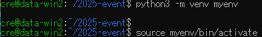
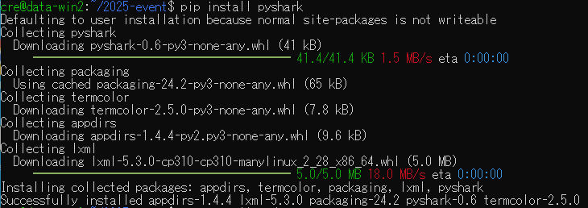
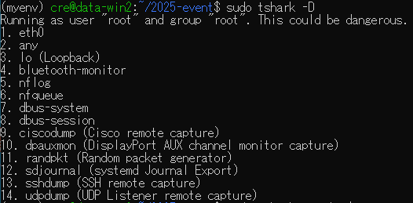
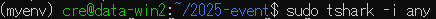
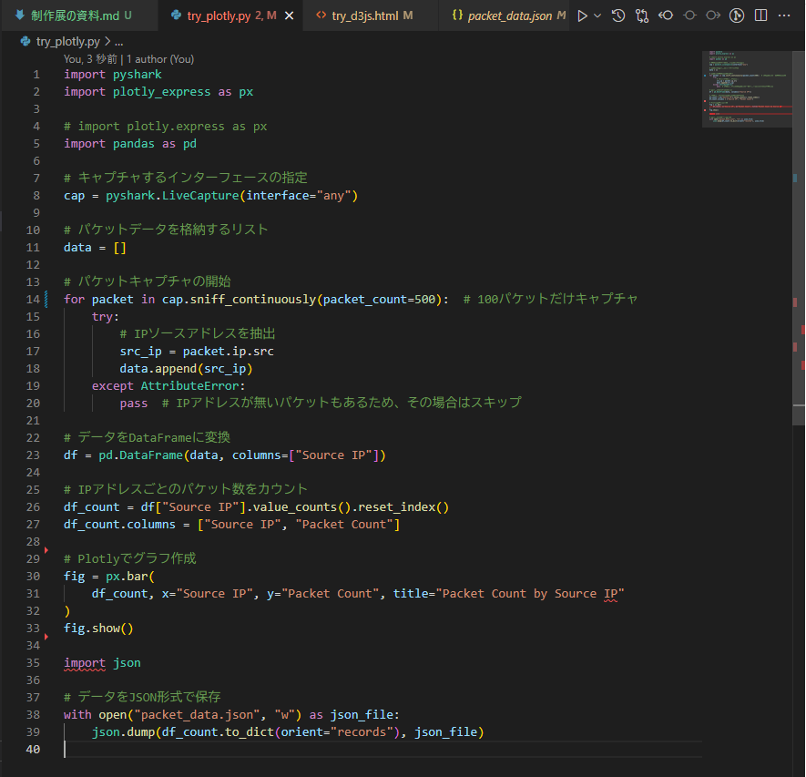
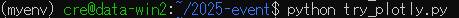
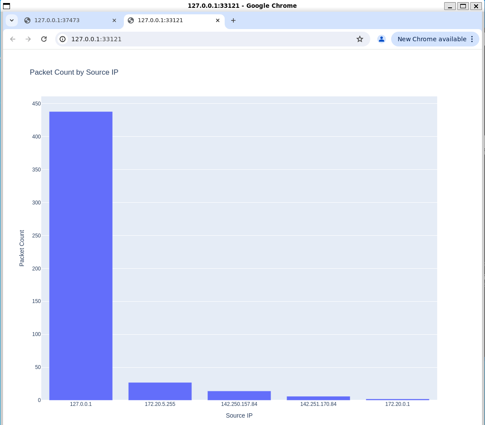
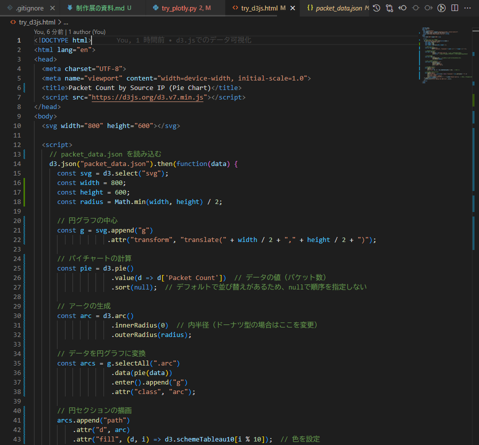
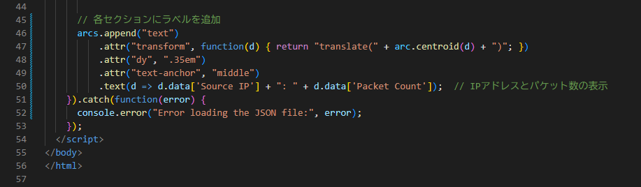
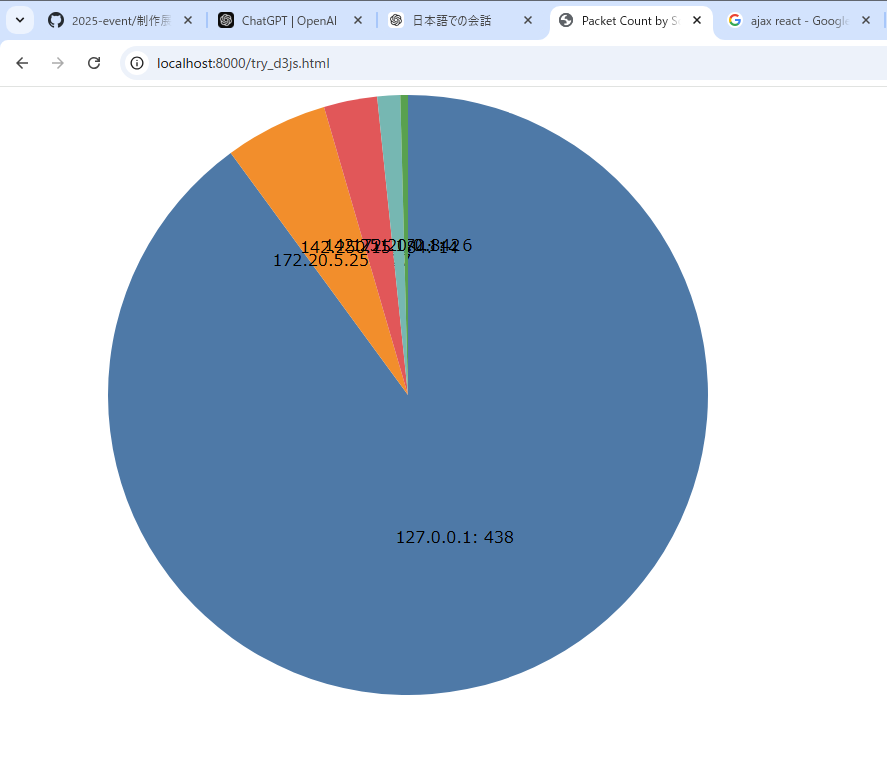

# gitの操作

cmd,powershellで実行する
# 管理者で実行する
wsl --install

pcを再起動

Whiresharkみたいなツールを作り、解析したデータをpython,javascriptを使ってグラフィカルに表示できるようにする
さらに機能を付け足せれば尚良い

libpcap(Unix系)ライブラリをインストールする
パッケージリストを更新します
sudo apt update
libpcapをインストールします
sudo apt install libpcap-dev

コードをファイルに保存します。例えば、capture.cという名前で保存します。

Cコードをコンパイル(wsl2上のubuntuで実行)
gcc capture.c -o capture -lpcap

コンパイルが成功したら、実行します。
sudo ./capture

pythonでwhiresharkを使う

wsl2上のubuntuで仮想環境を作る
python3 -m venv myenv
source myenv/bin/activate

Pysharkをインストール
pip install pyshark

codecsをインストール
pip install codecs
hex値のままのパケットデータをutf-8に変換する必要があったためcodecsを使用。
codecsモジュールは、Pythonの標準ライブラリの一部です。したがって、pipでインストールする必要はない

UbuntuにTSharkをインストールする
sudo apt install tshark

利用可能なインターフェースのリストを表示
sudo tshark -D

表示されたインターフェースの中からキャプチャしたいインターフェースの番号（または名前）を指定して、以下のようにTSharkを実行。
sudo tshark -i インターフェース番号または名前

pythonのplotlyを使ってグラフ作成(簡単)

python try_plotly.py　をubuntu上で実行

javascriptのd3.jsを使ってグラフを作成する

python -m http.server 8000　をubuntu上で実行
ブラウザで以下にアクセス　http://localhost:8000/try_d3js.html
packet_data.json　に入っているデータがグラフ化される

今後、非同期通信で定期的にグラフを描画し直す

